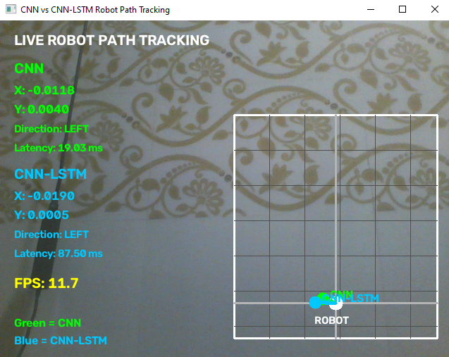

# Comparative Performance Benchmarking of CNN vs RNN/LSTM for Visual Robot Path Tracking and Action Prediction

## Project Overview

This project experimentally compares two deep-learning architectures for visual robot path tracking and action prediction:

- **CNN** — spatial visual feature extraction from a single frame
- **CNN-LSTM** — CNN-based visual feature extraction followed by LSTM temporal modeling over a sequence of five frames

The comparison focuses on:

- Trajectory prediction accuracy using **Mean Squared Error (MSE)**
- **Inference latency**
- **P95 latency**
- **Trainable parameter count**
- **Serialized model size**
- Behavior under **temporal frame occlusion**

The project was implemented in Python using PyTorch and evaluated on an **Intel Core i7 + 16 GB RAM** system using CPU execution.

---

## Objectives

1. Generate a synthetic visual dataset for robot path/action prediction.
2. Train a CNN model for visual trajectory prediction.
3. Train a CNN-LSTM model for sequential visual prediction.
4. Compare prediction accuracy.
5. Compare inference performance.
6. Compare model complexity and storage requirements.
7. Evaluate both architectures under temporal occlusion.
8. Perform critical analysis based on measured results.

---

## Project Architecture

```text
                    Synthetic Visual Dataset
                              |
                              v
                 Train / Validation / Test
                              |
                  +-----------+-----------+
                  |                       |
                  v                       v
                 CNN                  CNN-LSTM
                  |                       |
          Single-frame input       5-frame sequence
                  |                       |
                  v                       v
        Spatial feature extraction   CNN feature extraction
                  |                       |
                  v                       v
             Regression                 LSTM
                  |                       |
                  +-----------+-----------+
                              |
                              v
                    Trajectory Prediction
                              |
                              v
                   Performance Benchmark
                              |
          +-------------------+-------------------+
          |                   |                   |
         MSE               Latency           Occlusion
          |                   |                   |
          +-------------------+-------------------+
                              |
                              v
                     Critical Analysis
```

---

## Dataset

A synthetic dataset was generated specifically for this project.

Each sample contains:

- **5 sequential RGB frames**
- Resolution: **128 × 128**
- 3 color channels
- A **2-dimensional trajectory/action target**

### Dataset Split

| Dataset | Samples |
|---|---:|
| Training | 2,000 |
| Validation | 400 |
| Testing | 600 |
| **Total** | **3,000** |

### Dataset Shapes

Training input:

```text
(2000, 5, 128, 128, 3)
```

Training target:

```text
(2000, 2)
```

Test set:

```text
600 samples
```

Dataset files:

```text
dataset/data/train.npz
dataset/data/val.npz
dataset/data/test.npz
```

---

# Hardware and Software

## Hardware

```text
CPU  : Intel Core i7
RAM  : 16 GB
GPU  : Not used
Mode : CPU
```

## Software

```text
Python
PyTorch 2.13.0+cpu
NumPy
Pandas
Matplotlib
scikit-learn
Pillow
psutil
```

CUDA was not available during the benchmark:

```text
CUDA available: False
CPU mode: True
```

---

# Project Structure

```text
CNN_vs_RNN_Robot/
│
├── dataset/
│   ├── data/
│   │   ├── train.npz
│   │   ├── val.npz
│   │   └── test.npz
│   └── generate_dataset.py
│
├── models/
│   ├── cnn.py
│   └── cnn_lstm.py
│
├── training/
│   ├── train_cnn.py
│   └── train_lstm.py
│
├── evaluation/
│   ├── benchmark.py
│   ├── occlusion.py
│   ├── generate_plots.py
│   └── final_results.py
│
├── results/
│   ├── cnn_model.pth
│   ├── cnn_lstm_model.pth
│   ├── model_comparison.csv
│   ├── benchmark_results.csv
│   ├── occlusion_results.csv
│   ├── final_results.csv
│   └── figures/
│       ├── test_mse_comparison.png
│       ├── latency_comparison.png
│       ├── model_size_comparison.png
│       ├── parameter_comparison.png
│       ├── occlusion_mse.png
│       └── relative_occlusion_degradation.png
│
├── evaluation/
├── README.md
└── venv/
```

---

# Installation

Create and activate a virtual environment.

### Windows

```cmd
python -m venv venv
venv\Scripts\activate
```

Install the required libraries:

```cmd
pip install torch torchvision numpy pandas matplotlib pillow scikit-learn psutil
```

Verify the installation:

```cmd
python -c "import torch, torchvision, numpy, pandas, matplotlib, PIL, sklearn, psutil; print('ALL LIBRARIES INSTALLED SUCCESSFULLY')"
```

Expected:

```text
ALL LIBRARIES INSTALLED SUCCESSFULLY
```

Verify PyTorch:

```cmd
python -c "import torch; print('PyTorch version:', torch.__version__); print('CPU mode:', not torch.cuda.is_available())"
```

---

# Running the Project

## 1. Generate the Dataset

```cmd
python dataset\generate_dataset.py
```

The script generates:

```text
dataset/data/train.npz
dataset/data/val.npz
dataset/data/test.npz
```

Expected dataset sizes:

```text
Training  : 2000
Validation: 400
Testing   : 600
```

---

## 2. Train the CNN

```cmd
python training\train_cnn.py
```

The trained model is saved in the results directory.

---

## 3. Train the CNN-LSTM

```cmd
python training\train_lstm.py
```

The trained model is saved in the results directory.

---

## 4. Run the Benchmark

```cmd
python evaluation\benchmark.py
```

The benchmark measures:

- Test MSE
- Parameter count
- Model size
- Average latency
- Median latency
- P95 latency
- Memory measurement

Results are saved to:

```text
results/benchmark_results.csv
results/model_comparison.csv
```

---

# Final Benchmark Results

The following values are the actual measured results from the completed experiment.

| Metric | CNN | CNN-LSTM |
|---|---:|---:|
| **Test MSE** | **0.0000641020** | 0.0000659116 |
| **Parameters** | 249,218 | **145,058** |
| **Model Size** | 0.9556 MB | **0.5588 MB** |
| **Average Latency** | **45.1359 ms** | 58.3344 ms |
| **P95 Latency** | **55.9868 ms** | 121.3924 ms |

### Interpretation

**CNN performs better in:**

- Test MSE
- Average inference latency
- P95 latency

**CNN-LSTM performs better in:**

- Number of trainable parameters
- Serialized model size
- Explicit temporal modeling capability

---

# Prediction Accuracy

The standard test results are:

```text
CNN       : 0.0000641020
CNN-LSTM  : 0.0000659116
```

The CNN has approximately **2.74% lower test MSE** than CNN-LSTM.

Therefore, under the standard test condition:

```text
Winner: CNN
```

---

# Inference Latency

```text
CNN       Average : 45.1359 ms
CNN-LSTM  Average : 58.3344 ms
```

P95 latency:

```text
CNN       : 55.9868 ms
CNN-LSTM  : 121.3924 ms
```

The CNN has substantially lower latency and lower tail latency.

This is important for robotic applications where predictable response time is desirable.

---

# Model Complexity

```text
CNN
Parameters : 249,218
Size       : 0.9556 MB

CNN-LSTM
Parameters : 145,058
Size       : 0.5588 MB
```

CNN-LSTM has approximately **41.8% fewer parameters** than CNN.

It also has a smaller serialized model.

However, fewer parameters do not automatically mean lower inference latency. The CNN-LSTM processes a sequence of frames and performs recurrent operations, which introduces additional runtime overhead.

---

# Temporal Occlusion Experiment

A controlled temporal occlusion experiment was performed.

Occlusion levels:

```text
0%
20%
40%
60%
80%
```

The experiment progressively removed recent visual observations.

## Results

| Occlusion | CNN MSE | CNN-LSTM MSE | Winner |
|---:|---:|---:|---|
| 0% | **0.0000641020** | 0.0000659116 | CNN |
| 20% | **0.0009340552** | 0.0012382019 | CNN |
| 40% | **0.0009340552** | 0.0014122837 | CNN |
| 60% | **0.0009340552** | 0.0014800472 | CNN |
| 80% | **0.0009340552** | 0.0015088661 | CNN |

Results are saved to:

```text
results/occlusion_results.csv
```

---

# Important Occlusion Interpretation

The constant CNN MSE from 20% through 80% occlusion should **not** be interpreted as proof that CNN is inherently more robust to temporal occlusion.

The reason is architectural:

- The CNN receives only the final frame.
- The CNN-LSTM receives a sequence of five frames.
- The occlusion experiment removes the most recent frames.
- Once the final frame is blanked, additional occlusion of earlier frames does not change the CNN's input.

Therefore, the CNN receives effectively the same final-frame input for the 20–80% conditions.

The CNN-LSTM, in contrast, processes the sequence and its error continues to change as more recent observations are removed.

This is an important limitation and critical-analysis point of the experiment.

---

# Generated Outputs

The project produces the following result files:

```text
results/
│
├── model_comparison.csv
├── benchmark_results.csv
├── occlusion_results.csv
├── final_results.csv
│
└── figures/
    ├── test_mse_comparison.png
    ├── latency_comparison.png
    ├── model_size_comparison.png
    ├── parameter_comparison.png
    ├── occlusion_mse.png
    └── relative_occlusion_degradation.png
```

## Graph Descriptions

### 1. `test_mse_comparison.png`

Compares standard test trajectory prediction MSE between CNN and CNN-LSTM.

### 2. `latency_comparison.png`

Compares average inference latency.

### 3. `model_size_comparison.png`

Compares serialized model sizes.

### 4. `parameter_comparison.png`

Compares trainable parameter counts.

### 5. `occlusion_mse.png`

Shows prediction error as temporal occlusion increases.

### 6. `relative_occlusion_degradation.png`

Shows MSE relative to each model's 0% occlusion baseline.

---

# Final Results Summary

| Evaluation Criterion | CNN | CNN-LSTM | Better |
|---|---:|---:|---|
| Test MSE | **0.0000641020** | 0.0000659116 | CNN |
| Parameters | 249,218 | **145,058** | CNN-LSTM |
| Model Size | 0.9556 MB | **0.5588 MB** | CNN-LSTM |
| Average Latency | **45.1359 ms** | 58.3344 ms | CNN |
| P95 Latency | **55.9868 ms** | 121.3924 ms | CNN |
| 0% Occlusion | **0.0000641020** | 0.0000659116 | CNN |
| 20% Occlusion | **0.0009340552** | 0.0012382019 | CNN* |
| 40% Occlusion | **0.0009340552** | 0.0014122837 | CNN* |
| 60% Occlusion | **0.0009340552** | 0.0014800472 | CNN* |
| 80% Occlusion | **0.0009340552** | 0.0015088661 | CNN* |

`*` Winner under the specific recent-frame occlusion protocol; not a claim of general occlusion robustness.

---

# Critical Analysis

The project demonstrates that a more complex architecture does not automatically provide better performance.

CNN-LSTM was designed to exploit temporal information, but it did not achieve lower test MSE than CNN in this experiment.

CNN also provided lower inference latency:

```text
CNN       : 45.1359 ms
CNN-LSTM  : 58.3344 ms
```

and substantially lower P95 latency:

```text
CNN       : 55.9868 ms
CNN-LSTM  : 121.3924 ms
```

However, CNN-LSTM was more compact in terms of parameters and serialized model size.

Therefore, the best architecture depends on the deployment requirements.

For this particular project:

> **CNN provides the best overall trade-off when prediction accuracy and inference speed are prioritized.**

CNN-LSTM may become more useful when genuine temporal dependencies are present in a real-world dataset.

---

# Limitations

1. The dataset is synthetic rather than collected from a physical robot.
2. Evaluation was CPU-only on an Intel Core i7 system.
3. CNN receives one frame while CNN-LSTM receives five frames.
4. The occlusion experiment uses a specific recent-frame occlusion protocol.
5. The CNN-LSTM sequence length is limited to five frames.
6. The models were not deployed on a physical robot.
7. Results may differ with real-world camera noise, motion blur, lighting variation, and dynamic obstacles.

---

# Future Scope

Possible future improvements include:

- Collecting real robot camera data.
- Deploying the models on Raspberry Pi or NVIDIA Jetson.
- Testing GPU and edge-AI inference.
- Comparing GRU and ConvLSTM.
- Comparing 3D CNN architectures.
- Testing Vision Transformers.
- Adding attention mechanisms.
- Testing random and partial image occlusion.
- Testing motion blur and lighting changes.
- Using longer temporal sequences.
- Performing real-time physical robot experiments.

## Real-Time Camera Demonstration

The trained CNN and CNN-LSTM models were also tested using a live webcam to demonstrate real-time visual path prediction.

The live application displays:

- CNN predicted X and Y coordinates
- CNN-LSTM predicted X and Y coordinates
- Predicted movement direction
- CNN inference latency
- CNN-LSTM inference latency
- Real-time FPS
- Robot coordinate grid
- Separate visualization of CNN and CNN-LSTM predictions

### Live Camera Result



### Example Live Inference

| Metric | CNN | CNN-LSTM |
|---|---:|---:|
| X Prediction | -0.0119 | -0.0202 |
| Y Prediction | 0.0040 | 0.0000 |
| Direction | LEFT | LEFT |
| Inference Latency | 46.10 ms | 152.25 ms |

The CNN produced a lower inference latency than the CNN-LSTM model during the CPU-based webcam demonstration. Both models predicted a leftward movement based on their negative X-coordinate predictions.

> **Note:** The webcam demonstration is intended to validate real-time model deployment and visualization. The models were trained using a synthetic dataset, so the camera demonstration should not be interpreted as a validated real-world autonomous robot navigation system.

---

# Conclusion

The project experimentally compared CNN and CNN-LSTM architectures for visual robot path tracking and action prediction.

CNN achieved:

```text
Test MSE        = 0.0000641020
Average latency = 45.1359 ms
P95 latency     = 55.9868 ms
```

CNN-LSTM achieved:

```text
Test MSE        = 0.0000659116
Average latency = 58.3344 ms
P95 latency     = 121.3924 ms
```

CNN-LSTM had fewer parameters and a smaller model:

```text
CNN-LSTM parameters = 145,058
CNN-LSTM size       = 0.5588 MB
```

Overall:

> **CNN was the better-performing architecture for this experimental setup when trajectory prediction accuracy and inference speed were prioritized, while CNN-LSTM provided advantages in parameter count, model storage, and explicit temporal modeling.**

The project highlights the importance of evaluating deep-learning architectures empirically across multiple dimensions rather than assuming that temporal or architectural complexity will automatically improve performance.

---

# License

This project is intended for academic and educational use.

---

# Author

**Ovais Patel**

Electronics and Computer Science Engineering Student | Software Enthusiast |Machine Learning Enthusiast | Embedded Systems Developer

⭐ If you found this project interesting, consider starring the repository.